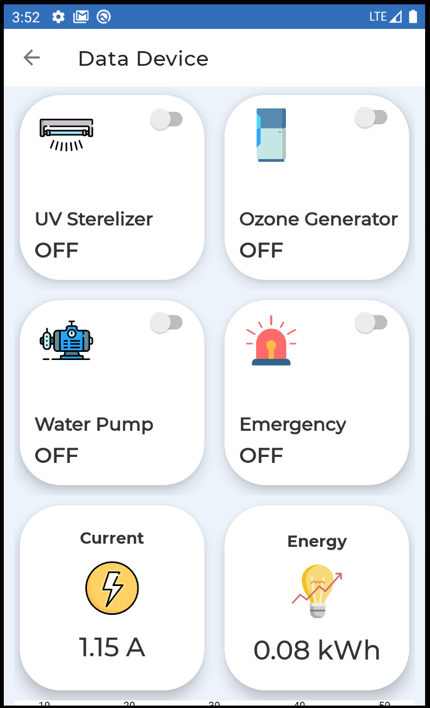

# **Documentation**

## *feature-dashboard-mws*

Dashboard MWS display the value of water temperature and digital power meter sensor and indicator of sensor and relay state in android apps. This feature using firebase realtime database to saving data from ESP32 and communicate between App and firmware. 

## **Tools and Libraries**

**Node MCU ESP32**
- FirebaseESP32
- ArduinoJson
- Dalas Temperature
- EEPROM
- OneWire
- PZEM004Tv30

**Android**
- Firebase
- MPChart

## **Flow**

// Transmiter State Relay

FisTx app -> Firebase -> NodeMCU ESP32

- FisTx app sent data relay state ON (1) or OFF (0) to Firebase
- Firebase save data from relay and sensor water temperature

// Transmiter Data Water Temperature and Digital Power Meter

NodeMCU ESP32 -> Firebase -> FisTx app

- NodeMCU ESP32 sent data relay state ON (1) or OFF (0) to Firebase
- Firebase save data from relay and sensor water temperature

// Receiver Relay State

NodeMCU ESP32 -> Firebase -> FisTx app

- NodeMCU ESP32 request (GET) int data relay state ON (1) or OFF (0) from Firebase simultaneously

// Receiver Data Water Temperature and Digital Power Meter
- FisTx app request (GET) float data Water Temperature AND Digital Power Meter from Firebase simultaneously

## **Methods**

NodeMCU ESP32 (GET)

- (Firebase.getInt(fbdo, "/relayUV")
- (Firebase.getInt(fbdo, "/relayOzone")
- (Firebase.getInt(fbdo, "/relayPump")
- (Firebase.getInt(fbdo, "/relayEmergency")

Android FisTx app (MWS Dashboard) (SET)

- database.child("/relayUV").setValue(1)
- database.child("/relayOzone").setValue(1)
- database.child("/relayPump").setValue(1)
- database.child("/relayEmergency").setValue(1)

## Firebase Structure

## Setup

1. **Firebase**

- Add Firebase to FisTx app (https://firebase.google.com/docs/android/setup)
- Installation & Setup on Android (https://firebase.google.com/docs/database/android/start)
- Write Database (https://firebase.google.com/docs/database/android/start#write_to_your_database)
- Read Database (https://firebase.google.com/docs/database/android/start#read_from_your_database)

## Preview

### State and Activity
|Home                 |   Device             |   MWS Dashboard      |  
|:------------------:|:----------------------------:|:---------------------:|
|  |  |  |
